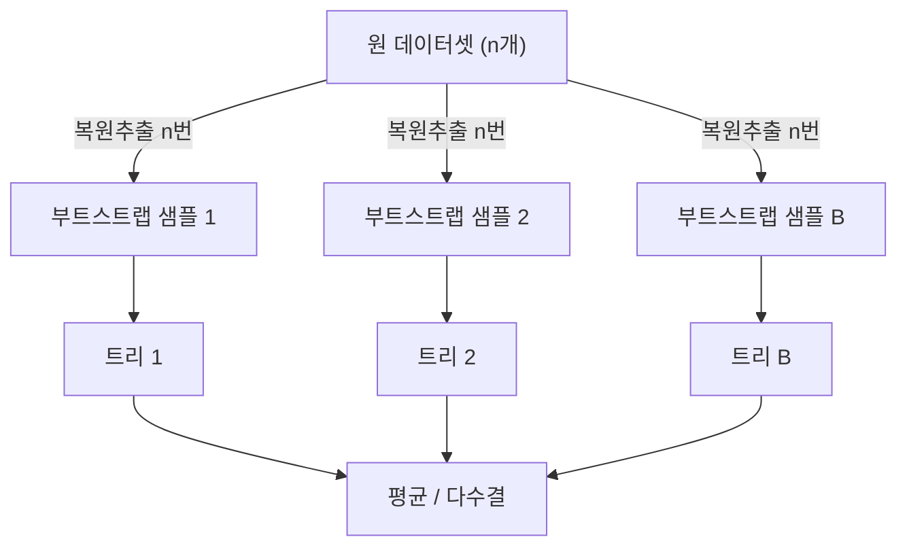

::: {.key-questions}
- 트리 하나의 variance를 어떻게 줄이는가? — **배깅(bagging)**
- 데이터가 한정적인데 어떻게 여러 training set을 만드는가? — **부트스트랩(bootstrap)**
- 왜 부트스트랩 샘플은 원 데이터의 약 63.2%만 포함하는가?
- **OOB 오차**가 어떻게 교차검증을 대신하는가?
- **랜덤 포레스트**는 배깅을 어떻게 개선하는가?
:::

> 시험 포인트: 트리 하나는 variance가 커서 성능이 낮다. **배깅**(부트스트랩 + 평균)으로 variance를 낮추고, **OOB**로 CV를 대신하며, **랜덤 포레스트**(피처 무작위 선택)로 트리 간 상관을 줄여 더 큰 variance 감소를 얻는다. (부스팅은 별도 영상)

## 1. 문제: 트리는 variance가 크다

같은 Hitters 데이터의 앞 절반(1~132번)과 뒤 절반(133~263번)으로 만든 트리는 **첫 분할 변수부터 완전히 다른 구조**가 나온다. training set이 조금만 바뀌어도 모델이 크게 변함 = variance가 큼.

## 2. 배깅(Bagging) = Bootstrap Aggregating

::: {.column-margin}
**통계적 근거**

독립 표본 $n$ 개 평균의 분산: $\sigma^2/n$ → 평균낼수록 변동성 감소
:::

통계의 원리를 그대로 가져온다: 모집단 분산이 $\sigma^2$ 일 때, 독립 표본 $n$ 개의 평균 $\bar{X}$ 의 분산은 $\sigma^2/n$ 로 줄어든다.

마찬가지로 트리를 한 번이 아니라 **여러 training set으로 $B$ 번 만들어 결과를 평균**내면 예측의 variance가 줄어 성능이 좋아진다.

$$ \hat{f}_{\text{avg}}(x) = \frac{1}{B}\sum_{b=1}^{B} \hat{f}_b(x) $$

- **회귀**: $B$ 개 트리 예측의 **평균**.
- **분류**: $B$ 개 트리 예측 클래스의 **다수결(majority vote)**.

**현실적 문제**: 같은 크기의 새 training set을 또 구하는 건 불가능(있었으면 이미 썼을 것). → 부트스트랩으로 해결.

## 3. 부트스트랩(Bootstrap)

가진 training set(크기 $n$)에서 **복원 추출(sampling with replacement)** 로 크기 $n$ 인 데이터셋을 다시 만든다. 어떤 데이터는 중복, 어떤 데이터는 누락된다. 이렇게 만든 것이 **부트스트랩 샘플**.

::: {.callout-important title="왜 63.2% — 부트스트랩의 핵심 성질"}
크기 $n$ 에서 특정 데이터가 한 번도 안 뽑힐 확률:
$$ P(n) = \left(1 - \frac{1}{n}\right)^{n} \xrightarrow{n\to\infty} e^{-1} \approx 0.368 $$
따라서 각 부트스트랩 샘플은 원 데이터의 **약 63.2% 를 포함**(36.8%는 누락). 새 데이터를 전혀 얻지 않았는데도, 모집단에서 새로 표본을 뽑은 것과 **유사한 효과**를 낸다.
:::

**검증(시뮬레이션)**: $N(0,1)$ 모집단에서 ① 크기 100 표본을 1,000번 **독립 추출**(실제 10만 개 사용)한 표본평균 분포와, ② **단 100개**로부터 부트스트랩 1,000번 만든 표본평균 분포가 거의 동일한 정규분포($\sigma=0.1$). → 100개만으로 충분하다는 것.

## 4. 배깅 적용 시 주의점

- **가지치기 불필요**: 각 트리는 $T_0$(큰 트리) 그대로 사용. 큰 트리는 bias↓·variance↑인데, 배깅이 **variance만 낮추고 bias는 그대로** 두므로, 굳이 가지치기로 bias를 올릴 필요가 없다.
- **$B$ 가 커도 과적합 안 됨**: $B$ ↑ → variance 계속 감소(다시 증가하지 않음). 보통 **50~500** 사이. 단, 각 트리가 유사한 데이터에서 나와 **완전 독립이 아니므로** variance 감소 효과에 한계가 있다(무한정 좋아지지 않음).
- **해석 가능성 저하**: 트리 하나의 직관적 해석은 잃는다.

## 5. OOB(Out-of-Bag) 오차 추정

각 부트스트랩 샘플에 **포함되지 않은 약 1/3** 데이터가 OOB 데이터. 특정 데이터 $i$ 는 그를 포함하지 않은 약 $B/3$ 개 트리에게 **미지의 데이터**다.

- 데이터 $i$ 의 **OOB 예측** = $i$ 를 안 쓴 트리들의 예측 평균.
- 모든 데이터의 OOB 예측 ↔ 실제값 → **OOB 오차**(회귀 MSE, 분류 error rate).
- OOB 오차는 **CV를 명시적으로 하지 않고도** test 오차를 추정 → 모델 선택·튜닝에 사용. (Hitters에서 OOB RMSE와 test RMSE의 패턴이 유사, OOB가 변동 더 작음)

## 6. 랜덤 포레스트(Random Forest)

배깅의 한계: 어떤 피처가 타깃에 강하게 영향을 주면 **대부분 트리가 그 피처로 루트를 분할** → 트리들이 비슷해짐(상관 ↑) → variance 감소 효과 제한.

::: {.column-margin}
**mtry (m)**

분류: $\sqrt{p}$
회귀: $p/3$
(튜닝 대상)
:::

**해결**: 각 분할마다 전체 $p$ 개 피처가 아니라 **무작위로 $m(<p)$ 개만** 후보로 두고 그중 best를 선택. 트리마다 무작위성이 추가되어 **트리 간 상관이 줄고**, 독립에 가까워져 variance 감소 효과가 커진다.

- 개별 트리 성능은 약간 떨어질 수 있으나, **더 큰 variance 감소**로 전체 성능이 향상.
- $m$ 은 튜닝 대상(CV 또는 OOB로 결정). $m=p$ 면 곧 배깅.

## 7. 부스팅 (다음, 영상)

::: {.callout-note title="부스팅 — 별도 영상 강의"}
교수님이 **영상으로 대체**. 배깅/랜덤 포레스트가 **복잡한 트리를 평균**내는 것과 반대로, 부스팅은 **단순한 트리를 순차적으로 더해** 직전 트리가 못 맞춘 부분(residual)을 다음 트리가 학습한다. (실습 Lecture 18에서 `gbm` 으로 다룸)
:::

::: {.lecture-summary}
- **배깅** = 부트스트랩 샘플마다 트리를 만들어 평균/다수결 → variance 감소.
- **부트스트랩**: 복원추출로 크기 $n$ 샘플 재생성. 각 샘플은 원 데이터의 **약 63.2%** 포함($(1-1/n)^n \to e^{-1}$).
- 배깅 트리는 **가지치기 불필요**, $B$ 커도 과적합 없음(50~500).
- **OOB 오차**(누락된 1/3로 평가)가 CV를 대신.
- **랜덤 포레스트**: 분할마다 피처 $m<p$ 무작위 선택 → 트리 상관↓ → variance 더 감소.
:::
