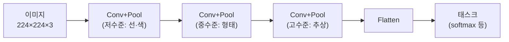
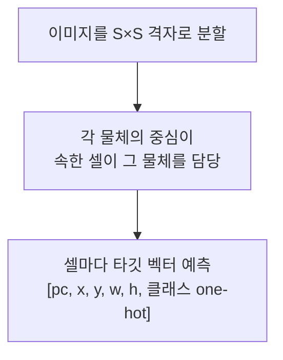

::: {.key-questions}
- **CNN**(합성곱·필터·풀링)은 왜 이미지에 적합한가?
- **얼굴 인식**은 왜 분류 문제로 풀 수 없고, 어떻게 푸는가? (임베딩 + triplet loss)
- **객체 탐지(object detection)** 의 멀티태스크 구조와 YOLO 원리는?
- **전이 학습(transfer learning)·파인튜닝** 은 무엇이고 언제 쓰는가?
:::

> 시험 포인트: CNN은 **필터(가중치 공유)** 로 파라미터 폭발을 막고 이미지의 계층적 표현을 스스로 학습한다. 같은 CNN 백본에 **입력·출력·손실만 바꾸면** 분류·얼굴인식·객체탐지로 확장된다. 얼굴 인식 = **임베딩 벡터 + triplet loss**(open-set라 분류 불가). 객체 탐지 = **YOLO**(셀마다 박스+클래스 동시 예측, 멀티태스크). 데이터·시간 절약은 **전이 학습**.

## 1. CNN 복습 — 왜 합성곱인가

::: {.column-margin}
**파라미터 절감**

완전연결: 픽셀마다 다른 가중치 → 폭발.
필터(3×3, RGB 3채널) = **27개 가중치**로 전체 이미지 처리.
:::

이미지를 픽셀로 펴면 피처가 매우 많고(예: $224\times224$), 완전연결로 모든 픽셀-노드를 잇면 **가중치 수가 폭발**한다.

- **합성곱(convolution) / 필터**: 작은 필터(예: $3\times3$)의 가중치만 정하고, 그 **하나의 필터가 이미지 전체를 슬라이딩**하며 같은 가중치를 모든 위치에 적용(가중치 공유). $3\times3$ 필터 × RGB 3채널 = **27개 가중치**만으로 충분.
- **필터의 의미**: 사람이 지정하지 않고, 이미지로부터 **선·원·색상·질감** 같은 기초 형태를 스스로 학습.
- **풀링(pooling)**: 예) $2\times2$ 영역의 **최댓값**(max pooling)으로 정보를 압축·축소. 중요한 정보만 남김.

합성곱 → 풀링 → 비선형 변환을 반복하면 **이미지 크기는 줄고($224 \to \cdots \to 7$), 깊이(필터 수)는 깊어진다.** 마지막에 1차원으로 펴서(flatten) 태스크 수행(분류면 softmax).

> 레이어가 깊어질수록: 초기엔 **단순 정보**(색·질감) → 점점 모아 **추상적 표현**(예: "고양이인지") 으로. 이것이 **계층적 표현 학습**.

## 2. 얼굴 인식 (Face Recognition)

핸드폰 잠금 해제·공항 게이트처럼, 저장된 얼굴과 새로 들어온 얼굴이 **같은 사람인지** 판단.

::: {.callout-warning title="왜 분류 문제로 못 푸는가"}
- **클래스 폭발**: 전 국민·수백만 명을 클래스로 둘 수 없음.
- **Open-set 문제**: 학습 때 **한 번도 본 적 없는 사람**이 들어올 수 있음 → 어떤 클래스에도 속하지 않아 분류 불가능.
:::

**해결: 임베딩 벡터(embedding vector)**. 이미지를 CNN에 통과시켜 출력층이 확률이 아니라 **$D$ 차원 벡터**(예 $D=100$)를 내게 한다. 각 차원이 피부색·눈 크기·눈 사이 거리·입술 모양 등 얼굴을 수치화한 표현.

- **같은 사람** 이미지들 → 임베딩이 **가깝게** 모임.
- **다른 사람** → 임베딩이 **멀게**.
- 새 얼굴의 임베딩과 저장된 임베딩의 거리가 충분히 작으면 "같은 사람". (고차원 공간에선 점 하나가 "우주의 먼지" — 다른 사람을 충분히 떨어뜨릴 여유가 큼. 핸드폰 오류율 ~10만분의 1.)

### Triplet Loss 로 학습

이미지 **3장**을 동시에 입력: **Anchor(A, 기준)**, **Positive(P, 같은 사람)**, **Negative(N, 다른 사람)**. **같은 가중치**의 CNN에 셋을 넣어 임베딩 $f(A), f(P), f(N)$ 을 얻는다.

목표: $A$-$P$ 는 가깝게, $A$-$N$ 은 멀게. 단순히 멀게가 아니라 **마진 $\alpha$ 만큼 항상 차이**나게:

$$ D_{AP} + \alpha \le D_{AN} $$

::: {.column-margin}
**마진의 의미**

$D_{AP}=10$, $\alpha=5$ → $D_{AN}$ 은 항상 15 이상이 되도록. 둘이 "비슷하게 가까운" 상태를 방지.
:::

위반 크기를 손실로:

$$ L = \max\!\left(0,\; \|f(A)-f(P)\|^2 - \|f(A)-f(N)\|^2 + \alpha\right) $$

조건을 만족하면($\le 0$) 손실 0, 위반하면 그 크기만큼 손실 → 역전파로 가중치·편향 갱신, 반복. **백본 CNN은 분류와 동일**, 출력(임베딩)과 손실(triplet)만 다름.

## 3. 객체 탐지 (Object Detection)

자율주행 카메라처럼, **이미지 안 여러 물체의 위치와 클래스를 동시에** 예측.

- **위치** = **바운딩 박스** $(x, y, w, h)$: 중심 좌표 $(x,y)$ + 폭 $w$ + 높이 $h$.
- **클래스** = 물체 종류 + confidence score(예: 사람 0.92, 자동차 0.95).
- 하나의 네트워크가 **위치 회귀 + 클래스 분류**를 동시에 → **멀티태스크 러닝**.

### YOLO (You Only Look Once)

이미지를 **격자(grid)** 로 나눈다(예 $7\times7$). 한 번만 보고 모든 걸 결정.

- 물체의 **중심이 속한 셀**이 그 물체를 예측.
- 각 셀의 **타깃 벡터**: $[\,p_c,\; x, y, w, h,\; \text{클래스 one-hot}\,]$
  - $p_c$ = 셀에 물체 있으면 1, 없으면 0.
  - 물체 없는 셀은 $p_c=0$, 나머지는 무시(don't care).
- 클래스 3개면 벡터 크기 = $1+4+3 = 8$. 물체 4개면 셀 4개에 대해 예측.

### YOLO 손실 — 두 손실의 합

$$ L = \underbrace{\lambda\sum_{\text{물체 셀}}\left[(x-\hat x)^2+(y-\hat y)^2+(\sqrt w-\sqrt{\hat w})^2+(\sqrt h-\sqrt{\hat h})^2\right]}_{\text{① 위치(localization) 손실}} + \underbrace{\sum_{\text{물체 셀}}\left(-\sum_k y_k \log \hat y_k\right)}_{\text{② 분류 손실(cross-entropy)}} $$

- **① 위치 손실**: 좌표·크기 예측의 제곱오차($w,h$ 는 루트 적용).
- **② 분류 손실**: 교차 엔트로피.
- $\lambda$ = 두 손실의 가중치(무엇을 더 중시할지). 합은 **물체가 있는 셀에 대해서만**.
- (식 암기 불필요 — 형태와 의미만.)

초기 레이어는 일반 이미지 분류처럼 색·질감을 잡고, 후반 레이어가 **위치+클래스를 동시에 설명하는 표현**을 학습.

## 4. 전이 학습(Transfer Learning) & 파인튜닝

처음부터 전체 네트워크를 학습하면 시간이 오래 걸린다. → **이미 학습된 네트워크**(가중치·편향이 정해진 것, 예: ImageNet으로 학습된 CNN)를 가져온다.

::: {.column-margin}
**레이어별 일반성**

초기 레이어 = 범용 정보(색·질감) → 거의 안 바뀜.
후반 레이어 = 태스크 특화 → 새 태스크에 맞게 조정.
:::

- 백본의 가중치를 그대로 가져오고 **마지막 출력 레이어만** 내 태스크(의료 영상 분류, 공장 불량 탐지 등)에 맞게 교체.
- 랜덤 초기화보다 **좋은 가중치에서 출발** → 학습이 훨씬 빠르고, 내 데이터가 적어도 좋은 성능.

**파인튜닝(fine-tuning)** — 데이터 양에 따라 조절:

| 내 데이터 양 | 전략 |
|---|---|
| 적음 | 초기 레이어 **동결(freeze)**, 마지막 레이어만 학습 |
| 보통 | 중간 이후 레이어부터 재학습 |
| 많음 | 전체 재학습(그래도 좋은 시작점이라 빠름) |

::: {.lecture-summary}
- **CNN**: 필터(가중치 공유)로 파라미터 폭발 방지, 풀링으로 압축. 크기↓·깊이↑, 계층적 표현 학습.
- 같은 CNN 백본 + **입력·출력·손실 변경** = 분류 / 얼굴인식 / 객체탐지로 확장.
- **얼굴 인식**: open-set라 분류 불가 → **임베딩 벡터**(같은 사람 가깝게) + **triplet loss**(마진 $\alpha$).
- **객체 탐지**: 바운딩 박스$(x,y,w,h)$ + 클래스 = 멀티태스크. **YOLO**(셀마다 $[p_c,x,y,w,h,\text{클래스}]$ 예측), 손실 = 위치 손실 + 분류 손실(가중치 $\lambda$).
- **전이 학습/파인튜닝**: 사전학습 모델을 가져와 마지막 레이어 교체·조정 → 빠르고 데이터 적어도 OK.
:::
